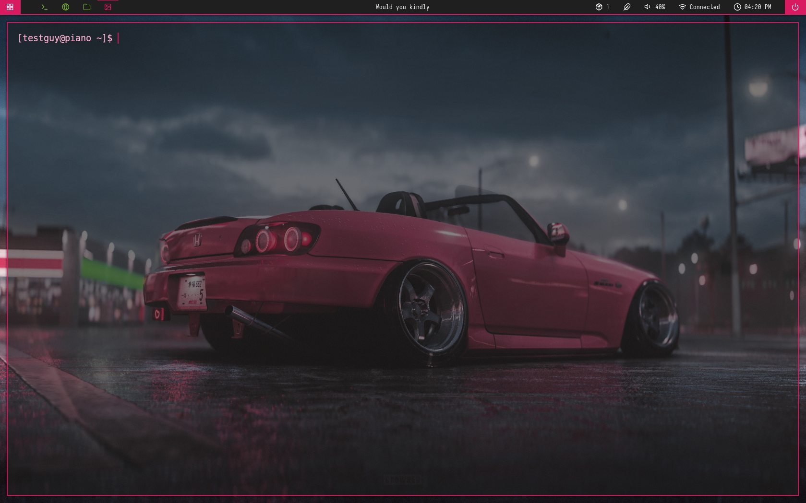

# i3 Dotfiles

Personal i3wm setup with Polybar (docky theme), Rofi, Kitty, Neovim, Yazi, and Dunst.

## Install

```bash
git clone https://github.com/traumachan7219-collab/i3-dots.git
cd i3-dots
./install.sh
```

## What's included

- i3 window manager config
- Polybar bar (docky theme) with cycling quotes
- Rofi launcher, powermenu, emoji picker, network menu
- Kitty terminal
- Neovim config (catppuccin pink theme)
- Yazi file manager (matching theme)
- Dunst notifications
- Default wallpaper
- Feather icon font

## Notes

- Edit `~/.config/polybar/docky/modules.ini` to fix audio sink & network interface
- Edit `~/.config/i3/config` to change wallpaper path
- Reload i3 with `Mod+Shift+R` after install
