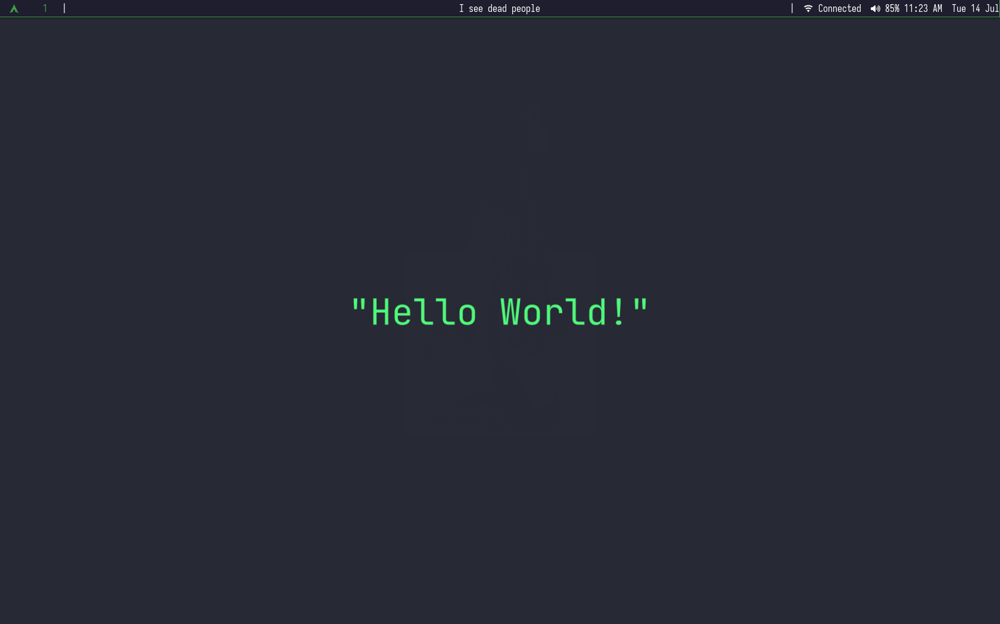

# i3 Dotfiles

Personal i3wm setup with Polybar , Rofi, Kitty, Neovim, Yazi, and Dunst.

## Install

```bash
git clone https://github.com/traumachan7219-collab/i3-dots.git
cd i3-dots
./install.sh
```

## What's included

- i3 window manager config
- Polybar bar  with cycling quotes
- Rofi launcher, powermenu, emoji picker, network menu
- Kitty terminal
- Neovim config 
- Yazi file manager (matching theme)
- Dunst notifications
- Default wallpaper
- Theme changer (mod+t)
- waypaperr (mod+shift+w)

## Notes

- install.sh only works on arch-based distros but you can always copy files
- Reload i3 with `Mod+Shift+R` after install
